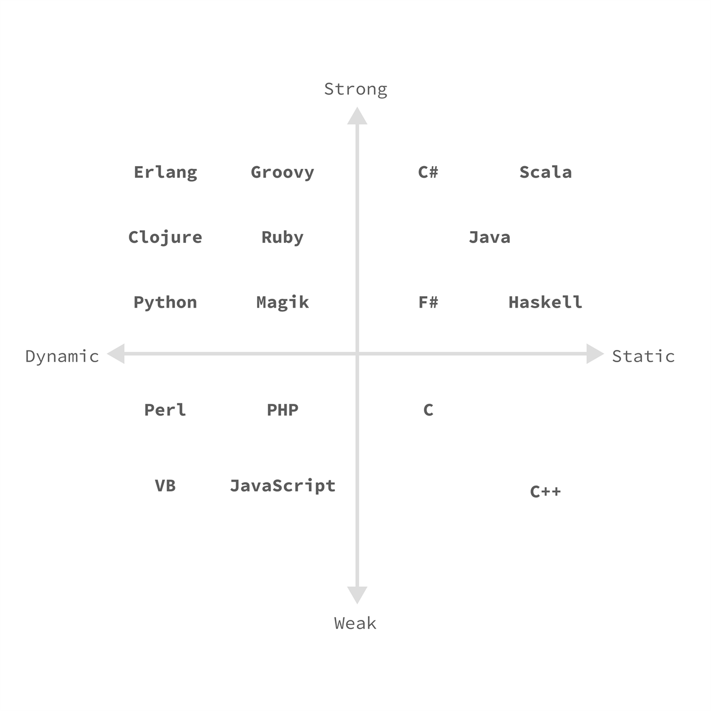

# 第 1 章 类型、实例和变量

## 1.1 类型
> Python 是动态的强类型语言；Python 的类型系统属于 Duck（鸭子）类型。


### 1.1.1 动态类型与静态类型

一门编程语言是静态类型还是动态类型，是根据其类型检查是在编译期执行还是在运行期执行。如果在编译期执行类型检查，那就是静态类型，否则就是动态类型。

对于静态类型语言，一般有两种现象：（1）在声明变量时，要指定其类型；（2）变量一旦声明后，其类型不允许被改变。

而对于动态类型语言，一般也有两种现象：（1）在声明变量时，不须要指定其类型；（2）变量声明后，其类型仍可以动态地被改变。

上述两种现象并不矛盾，如果想要在编译期执行类型检查，那么就要要求变量的类型在声明时就要确定下来，而且之后不能被改变，否则就无法在编译时确定一个变量的类型，只能在运行时，动态地检查变量的类型，然后再根据其类型判断其操作是否合法。

最近一些静态语言为了方便编写，也加入了一个特性：自动推导。即，编译器根据上下文自动推断出一个变量的类型。尽管这种特性不要求程序写明确地写出类型，但仍旧须要在编译时确定变量的类型，只不过它是隐式地（由编译器自动完成），而且该变量的类型被自动地推导出来之后，其类型就固定了，之后也不允许被改变。

另外，由于静态语言在声明时就已经知道了其类型，因此在运行时，可以对其进行更多的优化；反观动态语言，只有在运行时才能知道其类型，因此优化起来比静态语言要难得多。为了使解析器尽可能地进行优化，一些动态语言也支持在声明变量时指定其类型，且**约定**在运行时不会改变其类型（如 Python 从 3.6 开始支持变量类型注解），但这并不代表变量的类型不能被改变。

因此，判断一门语言是动态类型还是静态类型，可以简单地依据以下两个条件：
1. 声明变量时，是否 **`必须`** 要指定其类型。
2. 变量被声明后，是否可以改变其类型。

依据这两个判断条件，我们可以认为，`JavaScript`、`PHP`、`Python`、`Ruby` 等是动态语言，`C/C++`、`Java`、`C#`、`Go` 等是静态语言。


### 1.1.2 强类型与弱类型

一门编程语言是强类型语言还是弱类型语言，是根据其类型检查的严格程度。

相对于强类型语言，弱类型语言的类型检查不是很严格，倾向于容忍隐式类型转换，比如：形参类型是 `double` 的 C 函数，在调用时，可以传递 `int` 值作为其调用实参。而强类型语言一般不允许这么做，如 Go 语言禁止传递 `int` 类型值给 `double` 类型的参数(注：Go 中的 `double` 类型叫 `float64`)。

因此，我们可以认为，`C/C++`、`JavaScript` 等是弱类型的，而 `C#`、`Go`、`Java`、`Python` 等是强类型的。但这并不是绝对的或一定的，只能是是相对的或者是偏向于。用下面一张图可以很好地说明这个问题。



从上图可以看出，相对于 `C#`、`Java`，`Python` 是弱类型的；但相对于 `JavaScript`、`PHP`，`Python` 却是强类型的。


### 1.1.3 Duck 类型

> 当看到一只鸟走起来像鸭子、游泳起来像鸭子、叫起来也像鸭子，那么这只鸟就可以被称为鸭子。   —— James Whitcomb Riley

简单地说，Duck 类型就是：**`一个对象有效的语义，不是由继承自指定的类（通过类继承）或实现特定的接口（如 Java 中 interface），而是由该对象的当前方法和属性的集合来决定；在 Duck 类型中，关注的并不是对象的类型本身，而是该对象是如何使用`**。

在 Duck 类型系统中，只要想访问一个对象的属性或调用它的方法，不管该对象是何种类型，只要该对象拥有此属性或方法，就可以访问成功或调用成功。

比如：在 Python 中，定义了一个类型 `A` 以及它的一个实例 `a`，类型 `A` 及其父类中并没有定义方法 `printf()`，但并不代表实例 `a` 不能调用它；在 Duck 类型中，可以在类型 `A` 定义外向它的方法方法和属性集合中添加一个方法 `printf()`，此时就可以调用 `printf()` 了，如：

```python
>>> class A: pass
...
>>> a = A()
>>> a.printf = lambda: "hello"   # 向实例 a 的方法和属性集体中添加一个方法 printf
>>> print(a.printf())            # 打印字符串 "hello" 到终端上
>>> A.pp = lambda self: "hello"  # 向类型 A 的方法和属性集体中添加一个方法 pp
>>> print(a.pp())                # 打印字符串 "hello" 到终端上
```

细心的读者可能已经发现：
1. 为实例 `a` 添加方法时，`lambda` 表达式没有指定参数，而为类型 `A` 添加方法时，`lambda` 表达式却指定了参数。
2. 为类型 `A` 添加了方法但没有为实例 `a` 添加该方法，而实例 `a` 却能调用该方法。

关于这两个问题，先留给读者思考一下，后续章节会专门解答这两个问题。


## 1.2 实例和变量

实例是类型的实例化对象，一般也称为 **对象**。变量是实例的一个标签或引用，在其它的语言中，它被称为 **指针**。当然，在 Python 的底层实现中，也是通过指针来完成的，只不过，Python 隐藏了指针操作，用户可以直接通过变量这个标签来操作实例。

一个实例可以有多个标签，但一个标签在同一时刻、同一地点只能表示一个实例。换句话说就是，一个实例可以用多个变量来表示，但一个变量在同一个作用域中只能唯一地表示一个实例。如：
```python
>>> a = 123456789  # (1)
>>> b = a          # (2)
>>> print(id(a))   # (3)
1631911051024
>>> print(id(b))   # (4)
1631911051024
```
1. 把一个整数实例（或叫对象）`123456789` 赋值给变量 `a`，也即是，给整数实例 `123456789` 贴上一个标签 `a`。
2. 把变量 `a` 的值赋值给变量 `b`，也即是，给整数实例 `123456789` 再贴上另外一个标签 `b`。
3. 打印变量 `a` 所表示的值的唯一 ID，也即是，显示标签 `a` 所对应的实例对象是哪一个。
4. 打印变量 `b` 所表示的值的唯一 ID，也即是，显示标签 `b` 所对应的实例对象是哪一个。

从上述结果可以看出，变量 `a` 和变量 `b` 所表示的是同一个对象，我们可以同时通过变量 `a` 和 `b` 来使用此整数实例。

同时，我们也可以随时随地地改变一个标签的引用，将其表示为另外一个实例，甚至其类型也可以不同。
```python
>>> b = "abc"      # (1)
>>> print(id(b))   # (2)
1631911096248
```

1. 我们接着上面的样例，把另一个字符串实例 `"abc"` 赋值给变量 `b`，也即是，把标签 `b` 贴上到另外一个实例身上。
2. 再次打印变量 `b` 所表示的值的唯一 ID。

我们可以发现，此时，变量 `b` 所表示的对象已经变了，不再是之前的整数实例了。

由于整数实例是不可变类型，因此，我们不能改变该实例内部的值。对于一个可以改变内部值的类型（即可变类型），一旦内部值发现变化，将同时反应到所有的引用变量上。如：
```python
>>> a = [1, 2, 3]
>>> b = a
>>> b[0] = 'a'             # (1)
>>> print(id(a), a)        # (2)
1631913812872 ['a', 2, 3]
>>> print(id(b), b)        # (3)
1631913812872 ['a', 2, 3]
```
1. 通过变量 `b` 把列表中的第一个元素的值修改为字符串 `"a"`。
2. 打印变量 `a` 的 ID 和值。
3. 打印变量 `b` 的 ID 和值。

从上述结果我们可以发现，变量 `a` 所引用的列表也发生了变化，而且两个变量引用的是同一个列表对象。

这个引用，在 Python 中，有个名字叫 `name bind`（名字绑定）和 `name rebind`（名字重绑定）。即，把一个实例对象赋值给一个新变量时，这叫做 `name bind`，当再把另外一个实例对象赋值给此变量时，就叫 `name rebind`。

总结一下，（1）同一个实例对象可以同时有多个变量标签；（2）在同一个作用域中，同一个变量标签只能唯一地表示一个实例对象；（3）同一个变量标签，可以随时改变其引用对象，用来表示另外一个不同实例对象；（4）但在不同的作用域中，可以有相同的变量名来表示不同的实例对象。

打个比方，（1）在一个公司中，一个人可以有多个名字，一个是原名，一个是曾用名，另一个是外号，你无论叫哪个名字，都是指代同一个人；（2）如果有多个人有相同的名字，比如张三，那么你在叫张三这个名字时，别人就很难区分你是在叫哪一个人，因此，在同一个公司中，一个名字只能被一个人唯一地使用；（3）但是，叫张三的这个人可以说，以后他不再叫张三了，那么张三这个名字就空闲下来了，其他任何一个人就都可以使用张三这个名字了；（4）此时，在另外一个公司，也可以有其他人叫张三，这样在每家公司里叫张三，该公司里的其他人都可以知道是在叫谁。

最后，注意一点，在 Python 中，变量没有类型，类型属于对象，而不是变量名，变量名只是对对象的引用而已。可以简单地、粗略地认为，变量没有存储空间，它只是实例对象的一个标签。
